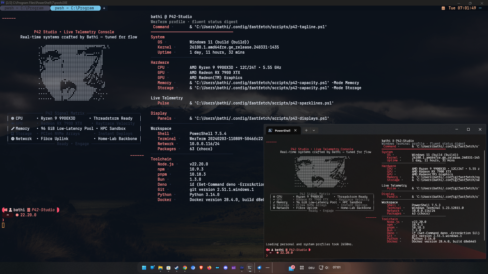

# Push42 WezTerm Workspace

Tailored WezTerm experience for the Push42 operations stack. This build layers neon-glass visuals, mode-aware prompts, telemetry-driven Fastfetch panels, and multi-domain launchers so Windows, WSL, and remote sessions feel unified.



---

## Table of Contents
- [Push42 WezTerm Workspace](#push42-wezterm-workspace)
  - [Table of Contents](#table-of-contents)
  - [Feature Highlights](#feature-highlights)
  - [Modes \& Telemetry Flow](#modes--telemetry-flow)
  - [Stack Requirements](#stack-requirements)
  - [Installation](#installation)
  - [Daily Workflows](#daily-workflows)
  - [Advanced Customization](#advanced-customization)
  - [Integration Notes](#integration-notes)
  - [Credits](#credits)

---

## Feature Highlights
- **Neon glass aesthetic** powered by `colors/custom.lua`, with animated cursors and 120 FPS visuals via WebGpu.
- **After-hours dimming**: `config/appearance.lua` automatically softens glass opacity and text glow from 21:00–07:00.
- **Prompt-mode seeding**: `events/gui-startup.lua` exports `P42_PROMPT_MODE` (`flow` vs `focus`), so PowerShell, Starship, and Fastfetch share the same state.
- **Dynamic backdrops**: `utils/backdrops.lua` caches metadata, supports random, sequential, fuzzy, and focus-glass toggles.
- **Signal-rich chrome**: `events/right-status.lua` renders date + battery with Nerdfont glyphs; `events/left-status.lua` displays leader/key-table status.
- **Adaptive tab titles**: `events/tab-title.lua` marks admin, WSL, debug, unseen-output counts, and allows manual locks/unlocks.
- **Launch workflows**: right-click the new-tab button for a unified launcher (default shells, WSL, SSH, Unix).
- **GPU adapter chooser**: `utils/gpu-adapter.lua` selects the fastest adapter/API combo per platform.
- **Fastfetch telemetry**: presets call `p42-*` scripts for memory, storage, display, tagline, and sparklines aligned with the prompt mode.

---

## Modes & Telemetry Flow
```
GUI startup -> set P42_PROMPT_MODE -> PowerShell profile -> Starship prompt
													  ↓                      ↓
										  Update-P42ActiveLogo     Fastfetch presets
													  ↓                      ↓
									  p42-active-logo.ansi    p42-{capacity,displays,...}
```

- **Day (`flow`) mode** keeps brighter glass, playful taglines, and full telemetry output.
- **Night (`focus`) mode** dims the UI, swaps fastfetch logos, hides playful text, and shortens status noise.
- The PowerShell profile (`Documents/PowerShell/Microsoft.PowerShell_profile.ps1`) is the bridge that updates the fastfetch logo and initializes Starship with the current mode.

---

## Stack Requirements
- WezTerm `20240203-110809-5046fc22` or newer (WebGpu front-end required).
- Starship `>= 1.20` (PowerShell profile shells out to `starship init powershell`).
- PowerShell 7.4+ with `RemoteSigned` (or more permissive) execution policy.
- JetBrainsMono Nerd Font installed system-wide; adjust `config/fonts.lua` if you prefer another family.
- Optional: curated wallpapers in `backdrops/` to get the most from the background controls.

---

## Installation
1. **Install Starship**
	```powershell
	winget install Starship.Starship
	```
2. **Install WezTerm** from the [official site](https://wezfurlong.org/wezterm/installation.html) or nightly builds (WebGpu required).
3. **Clone the config**
	```powershell
	git clone https://github.com/push42/wezterm-config.git $HOME/.config/wezterm
	```
4. **Launch WezTerm**. On first boot the GUI event maximizes the window and exports `P42_PROMPT_MODE` so every shell inherits the correct mode. The PowerShell profile then updates the active fastfetch logo and kicks off Starship.

---

## Daily Workflows
```
Alt+/          random wallpaper
Alt+Ctrl+/     fuzzy wallpaper search
Alt+, Alt+.    cycle background backward/forward
Alt+b          toggle focus-glass (distraction filter)

Alt+t          spawn default shell tab
Alt+Ctrl+t     spawn WSL: ubuntu-fish tab
Alt+Shift+Enter maximize window

Alt+0          lock tab title      Alt+Ctrl+0 unlock tab title
Alt+9          toggle tab bar      F12       show debug overlay
```

- **Right-click “+” button**: launcher with default shells, WSL, SSH, Unix domains.
- **Leader (Alt+Ctrl+Space)**: opens key tables for resizing fonts and panes.
- **GPU switch**: handled automatically—no manual input needed.

---

## Advanced Customization
- **Color scheme**: adjust `colors/custom.lua`. Meta fields control command palette, glass intensity, and accent colors.
- **Backdrops**: drop images into `backdrops/`. `utils/backdrops.lua` rescans on launch and stores metadata for faster fuzzy search.
- **Domains & launch menu**: edit `config/domains.lua` and `config/launch.lua` to align with your SSH targets, WSL distros, and default shells.
- **Bindings**: `config/bindings.lua` maps `SUPER` to Alt on Windows to avoid OS conflicts. Change `mod.SUPER` if you prefer the Win key or Cmd.
- **Telemetry scripts**: see `.config/fastfetch/scripts/p42-*.ps1`. They respect `P42_MODE`/`P42_PROMPT_MODE`; tweak them if you add more panels.

---

## Integration Notes
- The PowerShell profile copies `fastfetch/assets/{mode}-logo.ansi` into `p42-active-logo.ansi`, so Fastfetch always displays the right branding.
- Fastfetch presets (`fastfetch/presets/w11-*.jsonc`) drive capacity, sparklines, displays, and tagline sections by calling the `p42-` scripts.
- When toggling modes mid-session, run the digest or reopen the terminal to refresh cached telemetry.
- If Starship isn’t installed, WezTerm still loads but the profile will warn and skip prompt initialization.

---

## Credits
This customization builds on the excellent foundation by [Kevin Silvester](https://github.com/KevinSilvester/wezterm-config). Their work on backdrop tooling, GPU adapter selection, and tab layout logic made this overhaul possible.
